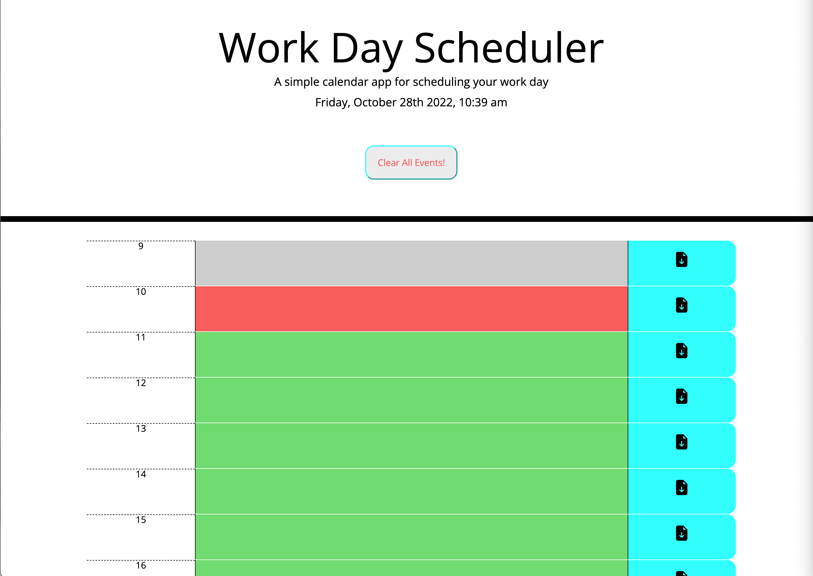

# Work Day Scheduler

## Description

This website is an application that acts like a great helper to all hardworking people. It tells you the current date and time< also displays the time blocks in different colors according to past, present and future time.

- My motivation to build this application was to create a presentable project with amazing working functionality. Also, a got to practice using Moment.JS, Bootstrap, and also expand my knowledge in JavaScript.

## Table of Contents

- [Description](#description)
- [Usage](#usage)
- [Credits](#credits)
- [License](#license)

## Usage 

1. Open a browser (Chrome, Safari, Mozilla, etc.)
2. Direct to the following link (https://fomin2000.github.io/work-day-scheduler/)
3. Time blocks will be displayed in different colors based on time of work day.
- Gray is past time
- Red is current time
- Green is future time
4. Time is also displayed in a 24-hour scheme: 17 is 5:00pm
5. Enter your events in the schedule and click save.
6. Click Clear All Events to remove from local storage and the display area

## Website Link

https://fomin2000.github.io/work-day-scheduler/

## Credits

© Paul Fomin 2022

## License 

MIT License